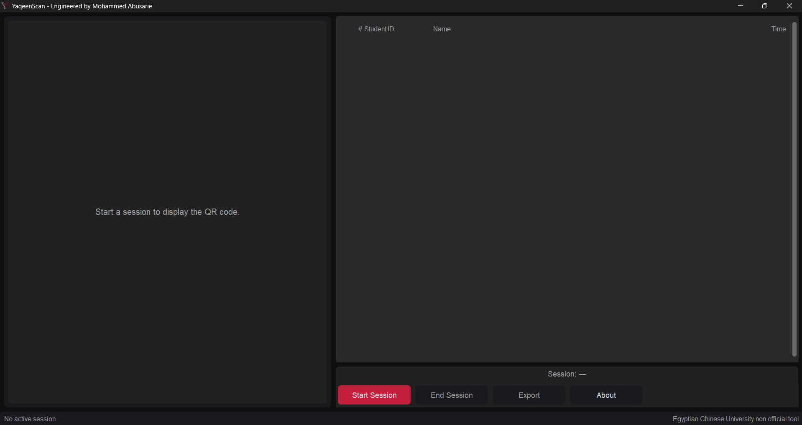
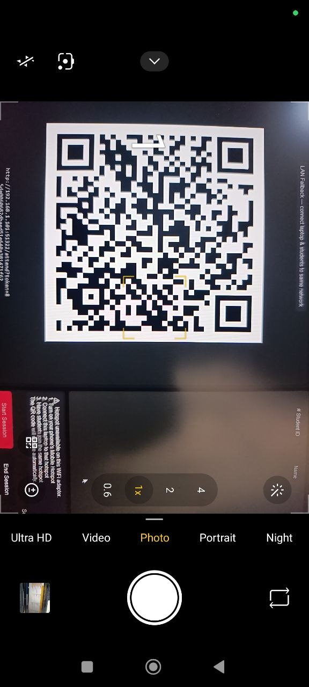

# YaqeenScan

**Offline QR attendance for university halls with no internet.**

Engineered by **Mohammed Abusarie**.

---

## The problem

Universities—especially places like the Egyptian Chinese University (ECU)—often hit two walls at once. Some lecture halls have **no reliable internet**, so cloud-based tools are a gamble. Meanwhile, **paper attendance** is slow, easy to misread, and eats into teaching time. Faculty need something that works in the room, every time, without depending on campus Wi‑Fi or mobile data.

## The solution

**YaqeenScan** turns the professor’s laptop into the hub of the session. It can create a **local Wi‑Fi hotspot**, show a **rotating QR code** on screen, and let students submit attendance through a simple web form—**all without needing the public internet**. Attendance is stored locally, visible on a live dashboard, and exportable when the session ends.

## How it works

1. **Professor launches the app and starts a session** — course or section details are set in the desktop app.
2. **The app creates a local Wi‑Fi hotspot** — students connect to that network; no outside internet is required.
3. **Students connect and scan the QR code** on the projector or shared display.
4. **They enter their ID and name** — submission takes seconds; the professor sees the count update in real time.

## Smart features

- **Works without internet** — Brings its own Wi‑Fi “bubble” into the room so attendance works even when the building’s network does not.
- **Rotating QR codes** — The code updates automatically so old screenshots cannot be passed around as valid check-ins.
- **One submission per device** — The system recognizes devices and blocks repeat submissions from the same device in a session.
- **Real-time dashboard** — Live attendance count on screen so you always know who has checked in.
- **Instant export** — Session data exports to CSV or Excel with minimal effort.
- **Stealth mode** — Runs on a random port with firewall lockdown so the service is harder to stumble across on the network.
- **Built-in security** — CSRF protection, input validation, rate limiting, and signed cookies help keep submissions trustworthy.
- **Auto cleanup** — Firewall, network, and related security changes are reverted when the session ends so the machine returns to a normal state.

## Screenshots

### Professor: main app



### Professor: starting a session


### Student: scanning the QR code



### Student: scan result (opens the local check-in flow)


### Student: local web form


### Student: attendance recorded


### Professor: live submissions on the desktop app


### After the session: export


### Exported records


## Quick start

**Prerequisites**

- Windows 10 or 11  
- Python 3.10 or newer  
- Administrator privileges (required for hotspot and firewall features at runtime)

**Install dependencies**

```bash
pip install -r requirements.txt
```

**Run the application**

```bash
python run.py
```

**Pre-built executable**

For a packaged `.exe` and build steps, see **[BUILD.md](BUILD.md)**.

## Building the executable

YaqeenScan can be built as a single Windows executable using PyInstaller. Full requirements, commands, and output paths are documented in **[BUILD.md](BUILD.md)** (including `build.ps1` and the project’s `.spec` files).

## Tech stack

- **Python** — Core application logic  
- **Flask** — Local web server for student submissions  
- **CustomTkinter** — Desktop GUI for the professor  
- **SQLite** — Local session and attendance storage  
- **QR code generation** — Rotating codes for secure check-in  

## Project structure

```text
YaqeenScan/
├── run.py                  # Entry point (orchestrates GUI, server, hotspot, security)
├── requirements.txt        # Runtime dependencies
├── requirements-build.txt  # PyInstaller / build dependencies
├── build.ps1               # Windows build script
├── *.spec                  # PyInstaller spec files (reproducible builds)
├── BUILD.md                # Executable build instructions
├── README.md               # This file
├── core/                   # Config, database, models, tokens, device fingerprinting
├── gui/                    # CustomTkinter main window and panels
├── server/                 # Flask app, routes, HTML templates, static assets
├── network/                # Hotspot and related network helpers
├── security/               # Firewall, ICS, and name-resolution hardening
├── export/                 # CSV / XLSX export
└── tests/                  # Smoke and regression checks
```

## License

_License to be determined. Contact the maintainer for use outside the intended university context._

## Credits

**YaqeenScan** was engineered by **Mohammed Abusarie** for the **Egyptian Chinese University**, to make attendance reliable in real lecture halls—not only on paper and not only when the internet cooperates.
